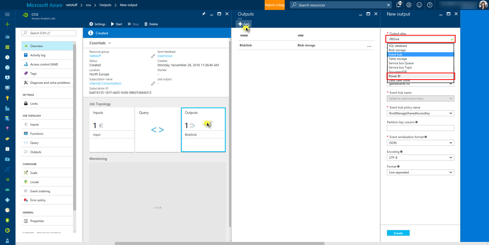
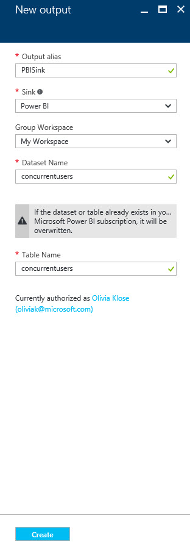

# Analytics

The analytics building block of Nether builds an architecture specified in [here](analytics-architecture.txt).

## Prerequisites

* Power BI: active Power BI subscription or register for free for [Power BI](https://powerbi.microsoft.com/en-us/).
* Azure Storage Explorer: To be downloaded [here](http://storageexplorer.com/).

### Azure Storage

## What does it do?
Currently, the following key KPIs will be delivered by the analytics building block:
* DAU (daily active users): number of distinct users per day.
* MAU (monthly active users): number of distinct users per month.
* YAU (yearly active users)
* daily active sessions, i.e. non-distinct daily active users
* monthly active sessions
* yearly active sessions
* daily game session duration
* monthly game session duration
* yearly game session duration
* daily generic duration
* monthly generic duration
* yearly generic duration

More scripts that are not integrated in any scheduled pipeline yet include:
* counts
* counts per displayName per game session
* counts per property
* levels at which a game session has ended (i.e. player has failed)
* daily level dropout distribution
* monthly level dropout distribution
* yearly level dropout distribution

The analytics part of Nether deploys an architecture using an ARM template and consists of the following high-level parts:
1. Event ingest, including the event data generator.
2. Real time layer or hot path.
3. Batch layer or cold path.
4. Visualization.

### 1. Event Ingest

Game events are being sent from the client to a then deployed event hub. For information on what the structure of a game event is, refer to the [event APIs of analytics](api/analytics/ReadMe.md).
There is a simulator game event generator that sends such specified game events which can be found [here](https://github.com/MicrosoftDX/nether-playground/tree/master/GameEventsGenerator).
The event hub has the following consumer groups:
* asaRaw: For stream analytics job on raw data.
* asaCCU: For stream analytics job on concurrent users.

### 2. Real-time Layer / Hot Path

As seen in the [architecture diagram](analytics-architecture.txt), there are two Azure stream analytics (ASA) jobs that run queries on the event ingest:
Concurrent Users: This ASA job runs a query to calculate the number of concurrent users in specified time window. 

#### Concurrent Users

Source: Event hub deployed by the ARM template, using the consumer group "asaCCU".

Query: The T-SQL Query can be found [here](..\deployment\analytics-assets\ASA\ccu.txt).

Sink: Power BI. This has to be set up manually, since as of now setting up Power BI as a sink cannot be set within an ARM template. Click on the stream analytics job ("ccu") in the Azure portal, then on *Outputs* and add another output as shown here:


Output alias: PBISink
Sink: Power BI
Authorize connection as shown here:


Configure the rest of the output:
Dataset name: concurrentusers
Table name: concurrentusers



Navigate to powerbi.com, the data ingest can be found under the streaming datasets. Create a report from it as shown below.


#### Start Stream Analytics Jobs
Start the stream analytics job from the Azure portal. Cannot be triggered from within ARM template as of now.

### 3. Batch Layer / Cold Path

The cold path is shown on the right hand side of the [architecture diagram](analytics-architecture.txt) and consists of the following components:
* Blob storage
* HDInsight cluster on demand
* Azure SQL database
* Data factory

#### Blob storage
The blob storage stores all incoming raw game events (through Azure Stream Analytics) partitioned by date.


#### HDInsight: Hive Tables

Goal: Create Hive tables on DAU (daily active users), MAU (monthly active users), DAS (daily active sessions).
The Hive script that creates the before mentioned tables can be found [here](../deployment/analytics-assets/ADF/scripts/kpis-sliding.hql).

The hive script creates the external tables that are stored:
* as a Hive external table in a container called "intermediate" in given storage account.
* as a csv file in the container "results" in given storage account.
A list of all tables being created can be found [here](./analytics/analytics-hive-tables.md).

The on demand HDInsight cluster is configured to store the Hive metadata in the Azure SQL database. This allows for storing the metadata of hive tables, especially `rawevents`, such that for every day `rawevents` is extended by another partition of incoming raw data from the day before. This is configured in the HCatalog setting.

#### Azure SQL database

The three hive tables `dailyactiveusers`, `dailyactivesessions` and `monthlyactiveusers` are being copied into Azure SQL Database. The reason for Azure SQL DB is the fact it is a supported connected source in Power BI Web.


#### Azure Data Factory: Orchestrating and Scheduling the Cold Path
Azure data factory is a service to schedule and orchestrate data services. In the context of Nether, it will spin up an on demand HDInsight cluster once a day to crunch the incoming event data of the day.

Currently, there are two ARM templates for two different Azure Data Factories:
* [deployment/analyticsADFactiveUsers.json](../deployment/analyticsADFactiveUsers.json): provides tables regarding game session duration (on average per day, month, year), active users (per day, month, year), active sessions (per day, month, year)
* [deployment/analyticsADFdurations.json](../deployment/analyticsADFdurations.json): provides tables on durations of generic events (on average per day, month, year)

Both ADFs make use of 3 types of components:

1. Linked services: external resources such as storage account, SQL DB, HDInsight on demand (the first two being provisioned with the ARM template).
   * [storageLinkedService](../deployment/analytics-assets/ADF/LinkedServices/storageLinkedService)
   * [sqlLinkedService](../deployment/analytics-assets/ADF/LinkedServices/sqlLinkedService.json)
   * [HDIonDemandLinkedService](../deployment/analytics-assets/ADF/LinkedServices/HDIonDemandLinkedService.json)   Note  that it is important that the HDIonDemandLinkedService is deployed **after** storageLinkedService since the HDInsight cluster is dependent on it.
   
2. Datasets: data structures within the previously defined data stores (i.e. linked services), e.g. table in Azure SQL DB or in blob storage.
   * rawData: incoming raw events
   * dailyActiveUsers: hive table output from the hive script --> daily active users (DAU)
   * dailyActiveUsersCsv: hive table as a csv file
   * dailyActiveUsersSQL: output from the hive table stored in the Azure SQL DB
   * monthlyActiveUsers: hive table output from the hive script --> monthly active users (MAU)
   * monthlyActiveUsersCsv: hive table as a csv file
   * monthlyActiveUsersSQL: output from the hive table stored in the Azure SQL DB
   
3. Pipelines: logical grouping of activities in which actions are performed on your data. The activities in the ADF pipeline for the analytics part are as followed (in given order):
 
   1. Run Hive scripts and create Hive tables in the container "intermediate"
   2. Copy created Hive tables into another container "results" in the blob storage with the csv file extension (these are 3 separate activities)
   3. Copy csv files into Azure SQL Database.

### 4. Visualisation

#### Power BI Desktop

#### Power BI Web

#### Web APIs

## How do I deploy it?

1. Already have a storage account that contains the raw game event data in the container "gameevents" in a given resource group.

2. Run the PowerShell script [deployment/deployAnalyticsADF.ps1](../deployment/analyticsADFdurations.json). The arguments it asks for are as follows:

   * `resourceGrp`: Name of resource group that has already been created
   * `location`: Location
   * `scriptStorageAccount`: Name of storage account to be created for uploading Hive scripts
   * `storageAccount`: Name of already existing storage account that contains the raw game event data
   * `sqlServerName`: Name of Azure SQL Server yet to be created
   * `sqlServerAdminName`: Login Username of Azure SQL Server
   * `sqlServerAdminPassword`: Password to the Azure SQL Server
   * `dataFactoryName`: Name of the data factory to be created

   The PowerShell script does the following:

   * Creates another storage account to upload the Hive scripts
   * Creates an Azure SQL Server and Database
   * Deploys both Azure Data Factories

3. Create tables in Azure SQL DB: Run [deployment/analytics-assets/CreateTables.sql](../deployment/analytics-assets/CreateTables.sql) on the Azure SQL DB that has just been created by the ARM template.
   * In Visual Studio Code, make sure that you have installed the [mssql extension](https://marketplace.visualstudio.com/items?itemName=ms-mssql.mssql). To install, launch VS Code Quick Open (Ctrl+P), paste the following command, and press enter:
   
   ```ext install mssql```
   * Press F1 --> type "sql" --> select **MS SQL: Connect**. Alternatively, hit Ctrl+Shift+C.
   * Type in the required connection information, e.g. Azure SQL Server, database and login credentials.
   * Open the sql query [CreateTables.sql](../deployment/analytics-assets/ADF/scripts/CreateTables.sql). Press F1 --> type "sql" --> select **MS SQL: Execute Query**. Alternatively, hit Ctrl+Shift+E.