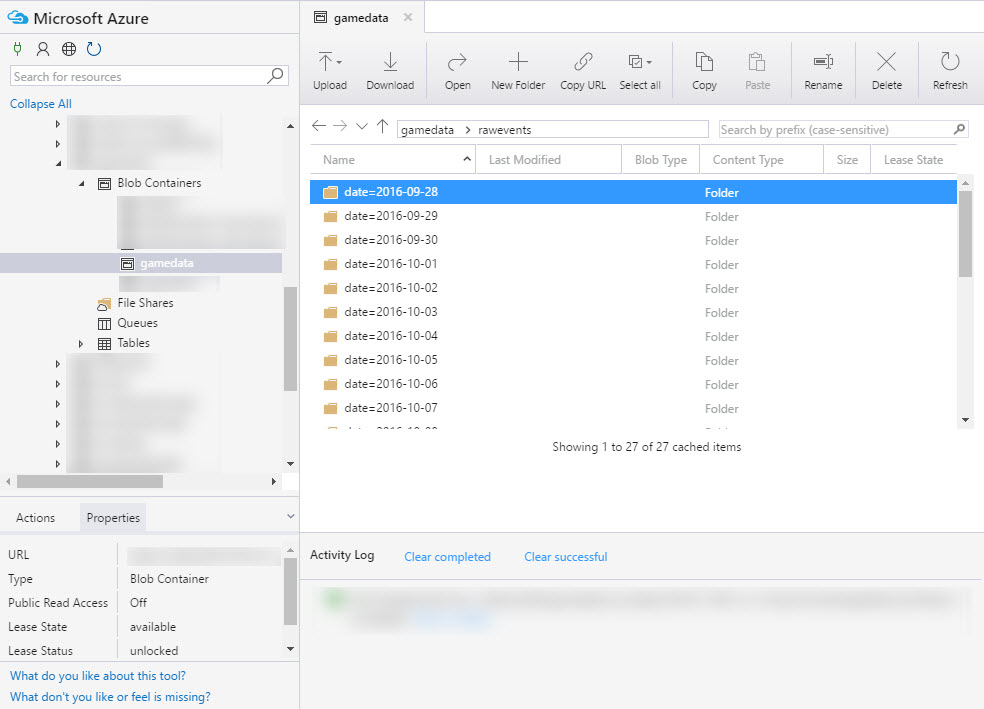
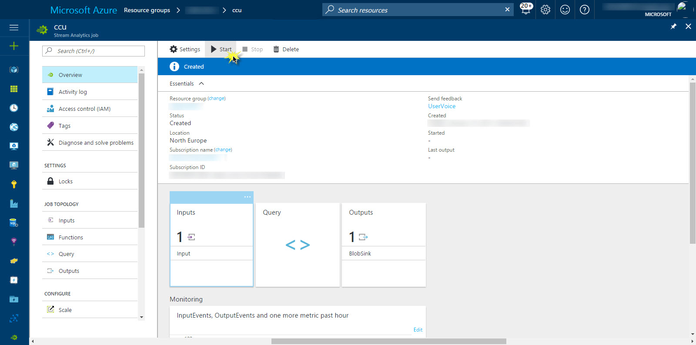
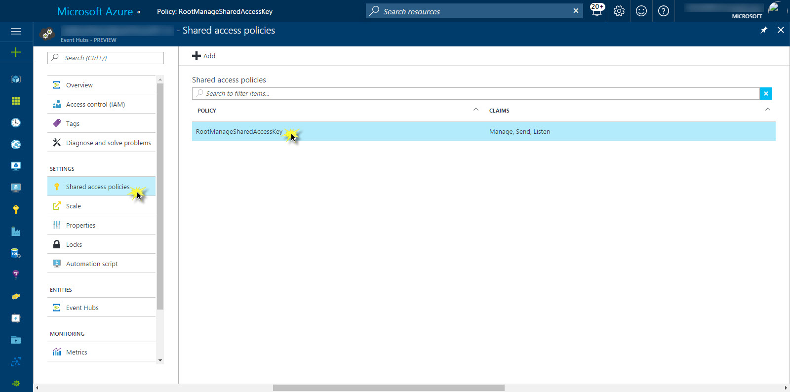
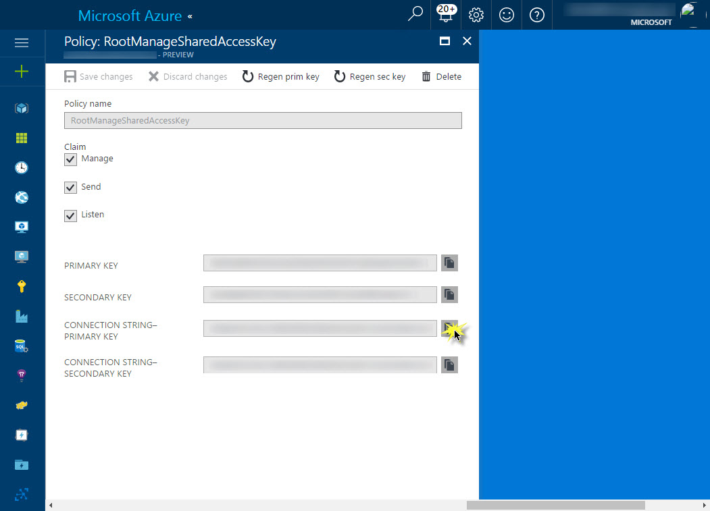

# Analytics

The analytics building block of Nether builds an architecture specified in [here](analytics-architecture.txt).

## Prerequisites

* Power BI: Power BI subscription or register for free for Power BI.
* Azure Storage Explorer: To be downloaded [here](http://storageexplorer.com/).

### Azure Storage

## What does it do?
Currently, the following key KPIs will be delivered by the analytics building block:
* DAU (daily active users): number of distinct users per day
* MAU (monthly active users): number of distinct users per monthly
* non-distinct daily active users, i.e. number of active sessions per day

The analytics part of Nether deploys an architecture using an ARM template and consists of the following high-level parts:
1. Event ingest, including the event data generator
2. Real time layer or hot path
3. Batch layer or cold path
4. Visualisation

### 1. Event Ingest

Game events are being sent from the client to a then deployed event hub. Information on what the structure of a game event is, refer to the [event APIs of analytics]](api/analytics/ReadMe.md).
There is a simulator game event generator that sends such specified game events to be found [here](https://github.com/MicrosoftDX/nether-playground/tree/master/GameEventsGenerator).
The event hub has the following consumer groups:
* asaRaw: For stream analytics job on raw data.
* asaCCU: For stream analytics job on concurrent users.

### 2. Real-time Layer / Hot Path

As seen in the [architecture diagram](analytics-architecture.txt), there are two Azure stream analytics (ASA) jobs that run queries on the event ingest:
1. Concurrent Users: This ASA job runs a query to calculate the number of concurrent users in specified time window. 
2. Raw Events: This ASA job stores all incoming game events in an Azure blob storage partitioned by date={YY-mm-dddd}. The raw events will be further aggregated and analysed in the batch layer. The T-SQL script can be found [here](..\deployment\analytics-assets\ASA\rawdata.txt).

#### Concurrent Users
Source: Event hub deployed by the ARM template, using the consumer group "asaCCU".
Query: The T-SQL Query can be found [here](..\deployment\analytics-assets\ASA\ccu.txt).
Sink: Power BI. This has to be set up manually, since as of now setting up Power BI as a sink cannot be set within an ARM template. Click on the stream analytics job ("ccu") in the Azure portal, then on *Outputs* and add another output as shown here:


Output alias: PBISink
Sink: Power BI
Authorize connection as shown here:


Configure the rest of the output:
Dataset name: concurrentusers
Table name: concurrentusers


Navigate to powerbi.com, the data ingest can be found under the streaming datasets. Create a report from it as shown below.


#### Raw Events
Source: Event hub deployed by the ARM template, using the consumer group "asaRaw".
Query: The T-SQL Query can be found [here](..\deployment\analytics-assets\ASA\rawdata.txt).
Sink: Azure blob storage that is provisioned by the ARM template, in the container *rawdata* under folderpath rawdata/date={yyyy-mm-dd}. Partitioned by date as opposed to by hour due to hive performance reasons.

#### Start Stream Analytics Jobs
Start both stream analytics jobs from the Azure portal. Cannot be triggered from within ARM template as of now.

### 3. Batch Layer / Cold Path

The cold path is shown on the right hand side of the [architecture diagram](analytics-architecture.txt) and consists of the following components:
* Blob storage
* HDInsight cluster on demand
* Azure SQL database
* Data factory

#### Blob storage
The blob storage stores all incoming raw game events (through Azure Stream Analytics) partitioned by date.


#### HDInsight: Hive Tables
Goal: Create Hive tables on DAU (daily active users), MAU (monthly active users), DAS (daily active sessions).
The Hive script that creates the before mentioned tables can be found [here](../deployment/analytics-assets/ADF/scripts/kpis-sliding.hql).

The hive script creates the following external tables:
1. `rawevents`: external table that is supposed to include all date partitions except for the current one. If it were to include all date partitions, you would run into a storage exception since both a stream analytics job and and HDInsight cluster want to access the same folder path. Currently, the script adds each date partition manually - this is subject to change.
2. `dailyactiveusers`: external table of two columns - date and number of active users on given date.
3. `dailyactivesessions`: external table of two columns - date and number of active sessions on given date.
4. `monthlyactiveusers`: external table of two columns - month and number of active users in given month.

The hive tables will be stored in the same storage container as the raw event data.

The on demand HDInsight cluster is configured to store the Hive metadata in the Azure SQL database. This allows for storing the metadata of hive tables, especially `rawevents`, such that for every day `rawevents` is extended by another partition of incoming raw data from the day before. This is configured in the HCatalog setting.

#### Azure SQL database

The three hive tables `dailyactiveusers`, `dailyactivesessions` and `monthlyactiveusers` are being copied into Azure SQL Database. The reason for Azure SQL DB is the fact it is a supported connected source in Power BI Web.

#### Azure Data Factory: Orchestrating and Scheduling the Cold Path

Azure data factory is a service to schedule and orchestrate data services. In the context of Nether, it will spin up an on demand HDInsight cluster once a day to crunch the incoming event data of the day.

Currently, the ADF (Azure Data Factory) within the ARM template (analyticsdeploy.json) is faulty and will result in error messages: storage exception or that the hive script cannot be found. Under [deployment/analytics-assets/ADF](../deployment/analytics-assets/ADF), you can find the JSON templates for ADF if you want to just deploy that through the portal or PowerShell. The file [deployADF.ps1](../deployment/analytics-assets/ADF/scripts/deployADF.ps1) contains a PowerShell script that you can run to deploy all JSON ADF templates. Note that you set certain variables and your Azure subscription according to your own Azure environment.

The ADF here makes use of 3 types of components:
1. Linked services: external resources such as storage account, SQL DB, HDInsight on demand (the first two being provisioned with the ARM template).
   * [storageLinkedService](../deployment/analytics-assets/ADF/LinkedServices/storageLinkedService)
   * [sqlLinkedService](../deployment/analytics-assets/ADF/LinkedServices/sqlLinkedService.json)
   * [HDIonDemandLinkedService](../deployment/analytics-assets/ADF/LinkedServices/HDIonDemandLinkedService.json)
   Note  that it is important that the HDIonDemandLinkedService is deployed **after** storageLinkedService since the HDInsight cluster is dependent on it.
2. Datasets: data structures within the previously defined data stores (i.e. linked services), e.g. table in Azure SQL DB or in blob storage.
   * rawData: incoming raw events
   * dailyActiveUsers: hive table output from the hive script --> daily active users (DAU)
   * dailyActiveUsersCsv: hive table as a csv file
   * dailyActiveUsersSQL: output from the hive table stored in the Azure SQL DB
   * monthlyActiveUsers: hive table output from the hive script --> monthly active users (MAU)
   * monthlyActiveUsersCsv: hive table as a csv file
   * monthlyActiveUsersSQL: output from the hive table stored in the Azure SQL DB
3. Pipelines: logical grouping of activities in which actions are performed on your data. The activities in the ADF pipeline for the analytics part are as followed (in given order):
   1. Run Hive script [kpis-sliding.hql](../deployment/analytics-assets/ADF/scripts/kpis-sliding.hql)
   2. Copy hive tables `dailyactiveusers`, `dailyactivesessions` and `monthlyactiveusers` into another folder in the blob storage with the csv file extension (these are 3 separate activities)
   3. Copy csv files into Azure SQL Database. This currently has some issue in the current version, since the format of the hive table is unix based.

### 4. Visualisation

#### Power BI Desktop

#### Power BI Web

#### Web APIs

## How do I deploy it?

1. Upload the Hive script [kpis-sliding.hql](../deployment/analytics-assets/ADF/scripts/kpis-sliding.hql) under *../deployment/analytics-assets/ADF/scripts/kpis-sliding.hql* into any blob storage account.
2. Configure the following parameters in the parameters file [analyticsdeploy.parameters.json](../deployment/analyticsdeploy.parameters.json):
   * eventHubName: by default set to `gameevents`
   * hiveScriptStorageAccountName: name of storage account where you have uploaded the aforementioned Hive script kpis-sliding.hql
   * hiveScriptStorageAccountKey: key of corresponding storage account
   * hiveScriptFilePath, e.g. [container]/[file-path]: container and file path of hive script
   * login credentials of the to-be-created Azure SQL DB
   * further properties of the Azure SQL DB - still tbd

3. Deploy the ARM template [analyticsdeploy.json](../deployment/analyticsdeploy.json) with its parameters file [analyticsdeploy.parameters.json](../deployment/analyticsdeploy.parameters.json). This will deploy the following:
```
azure group create -n <resource-group> -l <location>
azure group deployment create -f "<path-to-ARM-template>\analyticsdeploy.json" -e "<path-to-ARM-parameters-file>\analyticsdeploy.parameters.json" -g <resource-group> -n <deployment-name>
```
   * Event hub to ingest the incoming raw game events
   * Stream analytics jobs: ccu (concurrent users) and rawdata (raw data into blob)
   * SQL DB for two purposes:
      * storing final tables `dailyactiveusers` and `monthlyactiveusers`
      * storing Hive metadata
   * Storage account for raw data and hive tables.
   

4. Create tables in Azure SQL DB: Run [CreateTables.sql](../deployment/analytics-assets/ADF/scripts/CreateTables.sql) under *../deployment/analytics-assets/ADF/scripts/CreateTables.sql* on the Azure SQL DB that has just been created by the ARM template.
   * In Visual Studio Code, make sure that you have installed the [mssql extension](https://marketplace.visualstudio.com/items?itemName=ms-mssql.mssql). To install, launch VS Code Quick Open (Ctrl+P), paste the following command, and press enter:
   ```ext install mssql```
   * Press F1 --> type "sql" --> select **MS SQL: Connect**. Alternatively, hit Ctrl+Shift+C.
   * Type in the required connection information, e.g. Azure SQL Server, database and login credentials.
   * Open the sql query [CreateTables.sql](../deployment/analytics-assets/ADF/scripts/CreateTables.sql). Press F1 --> type "sql" --> select **MS SQL: Execute Query**. Alternatively, hit Ctrl+Shift+E.
5. Start the stream analytics jobs `rawdata` and `ccu` as shown below:
   

6. Configure game events generator with the connection string of the event hub that has just been created by the deployment of the ARM template.
   * Retrieve the connection string as followed:
     
     