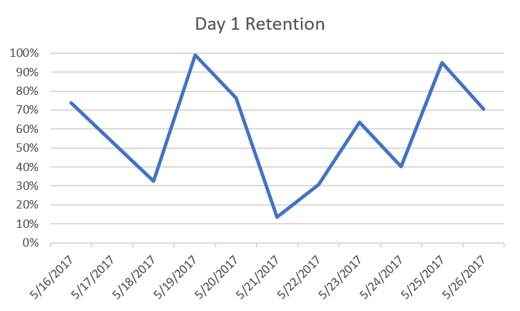

# User Retention

This recipe provides information on one of the most important metrics for a successful free-to-play game.
The user retention gives an indication on the level of engagement and the proportion of users returning to your game.

## End Result

You will answer the following question: The percentage of users who showed up again X days after installing/playing the game. X is typically 1, 7, 30 and 90. There are multiple ways to calculate the user retention ([User Retention: Yes, But Which One?](http://www.applift.com/blog/user-retention)); we will make use of the **classic retention** to calculate the user retention: Which proportion of users come back to the game on Day+X. For instance, for day 7 retention (i.e. X=7) we are interested in the proportion of people who come back precisely on day 7. It does not matter if they have played the game again on day 3 or any other day inbetween and how often before day 7:


_Classic Retention with X=7_

Moreover, the user retention is being calculated every day in a rolling window manner.
The retention is mostly interesting to display its trend over time. For instance, the table on Day 1 retention indicates that the level of user retention drops with progressing day. 

Day 1 Retention

| Date | Day 1 Retention |
|---------|----------|
| 2017-05-16T00:00:00.0000000 |	0.739 |
| 2017-05-17T00:00:00.0000000 |	0.53 |
| 2017-05-18T00:00:00.0000000 |	0.325 |



The above table shows that 73.9% of users who played the game on May 15th (or installed) played the game again on May 16th. However, only 53% of the people who played the game on May 16th returned to the game on the following day. 

Day 7 Retention

| Date | Day 7 Retention |
|---------|----------|
| 2017-05-16T00:00:00.0000000 |	0.98 |
| 2017-05-17T00:00:00.0000000 |	0.95 |
| 2017-05-18T00:00:00.0000000 |	0.98 |
| 2017-05-19T00:00:00.0000000 |	0.58 |
| 2017-05-20T00:00:00.0000000 |	0.56 |
| 2017-05-21T00:00:00.0000000 |	0.64 |
| 2017-05-22T00:00:00.0000000 |	0.6  |
| 2017-05-23T00:00:00.0000000 |	0.43 |
| 2017-05-24T00:00:00.0000000 |	0.43 |
| 2017-05-25T00:00:00.0000000 |	0.51 |
| 2017-05-26T00:00:00.0000000 |	0.37 |


This table shows that
* 98% of the people who played the game on May 9th 2017 returned to the game again on May 16th 2017. It is possible that some of the 98% have played the game sometime between the May 9th and May 16th, too, but it does not affect the Day 7 retention.
* Only 58% of the people playing the game on May 12th opened the game for a session again on May 19th 2017.
* 37% of the gamers on May 19th played the game again on May 26th.

The resulting retention visualisation is as follows:


The visualisation shows that the level of retention is decreasing - which is a bad indicator for the game

The same goes for Day 30 Retention and Day 90 Retention.

## Pre-requisites

Technologies:
* Azure Data Lake Analytics (ADLA) account and an associated Azure Data Lake Store (ADLS) account
* Generated messages, e.g. start and stop
    * Event Hub
    * AD application

Parameters:
* ``in``: folder location of all events, e.g. /nether/clustering/geo-location/2017/05/16/{*}.csv
* ``out``: file path where the output file is going to be stored, e.g. /nether/clustering/geo-location/2017/05/16/{*}.csv
* ``timeframe``: what period of time are you interested in for user retention; it is typically set at 1, 7, 30 and 90.


## Recipe Steps

TODO

### 1 Telemetry Needed from the Game

TODO
Using the Nether REST API or the provided Client SDKs setup the game to send the following messages at these times.

| Message to send                    | At what time                              |
|------------------------------------|-------------------------------------------|
| [start](../message-types/start.md)      | Send at specified time units, e.g. every 5 minutes  |


### 2 Configuration of Message Processor

TODO


### 3 Setup Job Queries

(TODO: Describe with a few sentences what purpose the job queries have (if any). Refer to the queries by linking to them in the source code and explain when they should be run.)

| Query that should be run           | By what service                           |
|------------------------------------|-------------------------------------------|
| []()             | Using ADLA (Azure Data Lake Analytics)    |


```cs

```

#### 3.1 Setup and Schedule U-SQL script

TODO

### 4 Result Details

Format:

**retention_2017-05-16T000000.csv**

| Timestamp | day1retention | day7retention | day30retention | day90retention |
|---------|----------|----------|----------|----------|
| 2017-05-16T00:00:00.0000000 |	0.739 | 0.98 | 0.74 | 0.32 |


**retention_2017-05-17T000000.csv**

| Timestamp | day1retention | day7retention | day30retention | day90retention |
|---------|----------|----------|----------|----------|
| 2017-05-17T00:00:00.0000000 |	0.53 | 0.95 | 0.72 | 0.52 |


**retention_2017-05-18T000000.csv**

| Timestamp | day1retention | day7retention | day30retention | day90retention |
|---------|----------|----------|----------|----------|
| 2017-05-18T00:00:00.0000000 |	0.325 | 0.91 | 0.82 | 0.23 |

In other words, running the query once a day will result in one file per day that includes the retention rates for day 1, 7, 30 and 90.


#### 4.1 Consume the result

(TODO: Explain in detail what results that should be expected and how to consume the result. Explain file formats produced by using tables.)
