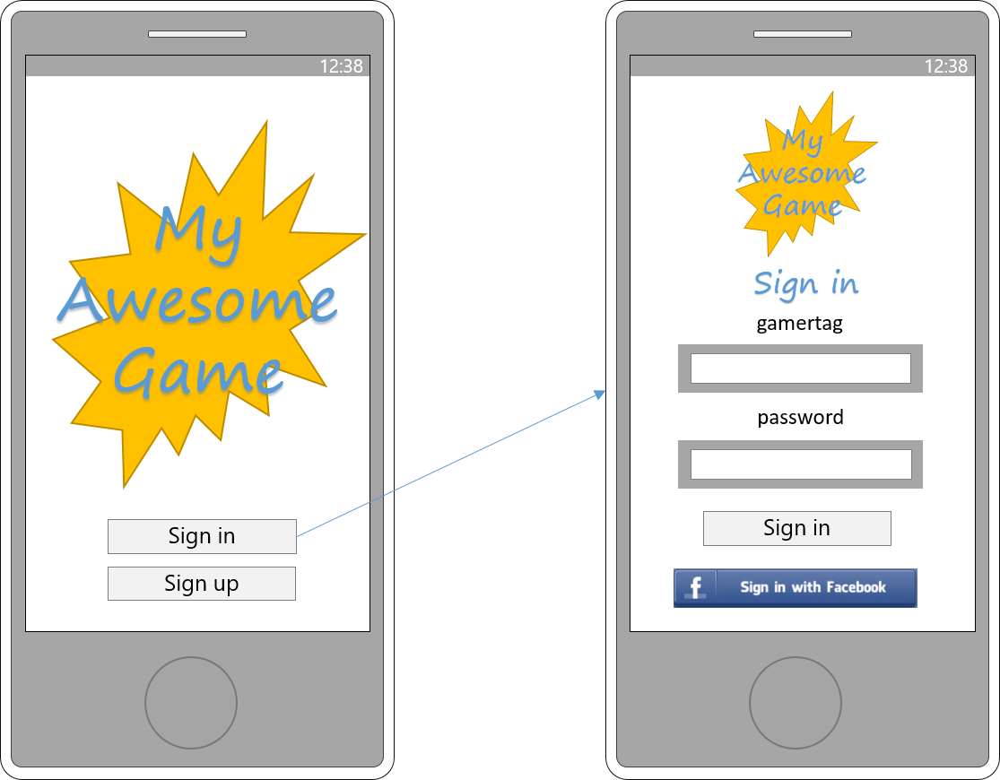
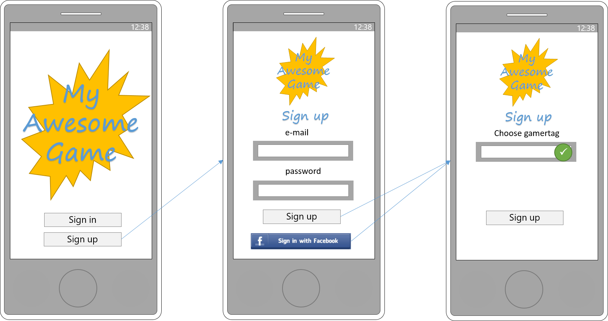

# Identity in Nether #

Any game developer should be able to add Identity support easily into their game.

## Configuring Nether Identity
WARNING: The identity implementation in still under development, so expect these details to change :-)

### Configuring facebook authentication
To configure the project to use facebook authentication you need to set up an application in facebook. The ASP.NET Core documentation [walks through this process](https://docs.microsoft.com/en-us/aspnet/core/security/authentication/facebook-logins#creating-the-app-in-facebook). Follow the "Creating the app in facebook" section of that documentation, and then save the `App Token` from [Access Token Tool](https://developers.facebook.com/tools/accesstoken) in configuration.

appsettings.json

```json
 "Facebook": {
    "AppToken": "<your token>"
  }
```

Or set environment variables:

```powershell
 # powershell
 ${env:Facebook:AppToken} = "<your token>"
```


```bash
 # bash
export Facebook__AppToken="<your token>"
```

### Configuring users
To add/configure users, modify the `Nether.Web/Features/Identity/Configuration/Users.cs` file. This currently has an in-memory list of users. This will be moved to a proper store implementation with APIs for configuring users in future.

## Authenticating with Nether Identity
The Nether Identity endpoint currently supports two means of authenticating: facebook user token and resource owner password (i.e. user name and password).
The facebook user token authentication uses a custom grant flow (`fb-usertoken`) to allow a non-interactive flow that receives a facebook user token (e.g. as per the facebook Unity extension) and converting it to a Nether token.
The resource owner password flow allows a user to sign in with user name and password combination. The main drivers for this flow are integration and load testing.


Since we don't currently have the client SDK for Nether created, I have created two sample projects showing how you can authenticate against the Nether Identity endpoint to get a token to use with other Nether APIs (under `/src/TestClients`):

* FacebookUserTokenClient
* IdentityServerTestClient

### FacebookUserTokenClient
This sample shows how to take a facebook user token (as available [here](https://developers.facebook.com/tools/accesstoken) for testing).
It has minimal dependencies, so will hopefully be easiest to make available to work across target environments

The `GetAccessTokenAsync` method performs the authentication call using the custom `fb-usertoken` authentication flow


### IdentityServerTestClient
This sample was created to show the different flows that are currently implemented:
* ClientCredentials - identifies the client application (not the user). Was useful as a validation step in the implementation
* ResourceOwnerPassword - signs in with a user name and password
* CustomGrant - signs in with a facebook user accesstoken

For speed of coding, this project used the [IdentityModel](https://www.nuget.org/packages/IdentityModel/) clienbt library from IdentityServer, but this isn't a requirement for clients.  


## Game Sign in ##


## Game Sign up ##



