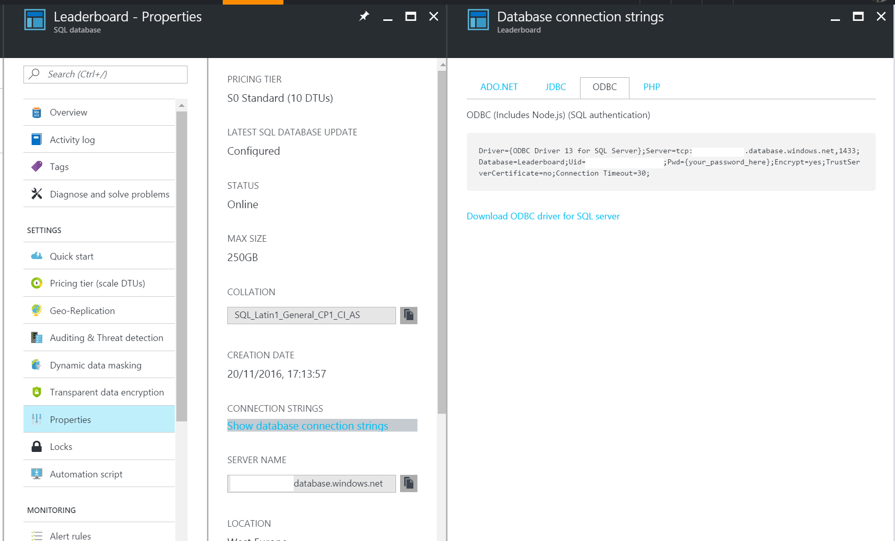

# Leaderboards

Simple leaderboard functionality, implementing Nether [leaderboard APIs](api/leaderboard), using SQL Database as a data store.

> WARNING: The leaderboard implementation in still under development

## Prerequisites
* SQL Database - [learn how to create a SQL Database](https://docs.microsoft.com/en-us/azure/sql-database/sql-database-get-started)
  > To test locally, you may use an on prem installation of SQL Server database
* Microsoft SQL Server Management Studio or Visual Studio - to query against the SQL tables

## leaderboard Setup
1. Obtain connection string for the Azure portal:
   
2. Update connection string in appsetting.json file:
   ```json
    Leaderboard": {
    "Store": {
      "wellknown": "sql",
      "properties": {
        "ConnectionString": "enter your connection string here"
      }
    },
   ```     
   Follow the [configuration](configuration.md) section in this repo for more details.

3. Create the _Scores_ table:
   **SQL Query:**
   
   ```sql
	CREATE TABLE [dbo].[Scores]
	(
	[Id] UNIQUEIDENTIFIER NOT NULL PRIMARY KEY DEFAULT NEWID(), 
    [Score] INT NOT NULL, 
    [GamerTag] NVARCHAR(50) NOT NULL, 
    [CustomTag] NVARCHAR(50) NULL, 
    [DateAchieved] DATETIME NOT NULL DEFAULT GETUTCDATE() 
	)

	GO

	CREATE INDEX [IX_Scores_1] ON [dbo].[Scores] ([DateAchieved], [GamerTag], [Score] DESC)
   ```
   **Deploy from Visual Studio**
    - Open Nether solution in Visual Studio
	- Right click on project Nether.Data.Sql.Schema	and select **Publish** to the SQL Database

## Leaderboards Configuration
The leaderboard _GET_ API will return various leaderboards, based on pre-defined configurations - top 10 ranks, all ranks, ranks around me and more.
The different types of leaderboards are defined in the appsetting.json file under the **Leaderboards** section, and can be extended by simply adding an entry for a new leaderboard.
In this configuration sample, we have 4 types of leaderboards:
```json
"Leaderboards": [
      {
        "Name": "Default",
        "Type": "All"        
      },
      {
        "Name": "5-AroundMe",
        "Type": "AroundMe",
        "Radius": 5
      },
      {
        "Name": "Top-5",
        "Type": "Top",
        "Top" :  5
      }
      {
        "Name": "Top-10",
        "Type": "Top",
        "Top" :  10
      }
    ]
```

**Usage:**

1. Default (all ranks) leaderboard: /api/leaderboard or /api/leaderboard/Default
2. Top 10 ranking players: /api/leaderboard/Top-10
3. Top 5 ranking players: /api/Leaderboard/Top-5
4. Players around me (5 below and 5 above the logged in player ranking): /api/leaderboard/5-AroundMe   


