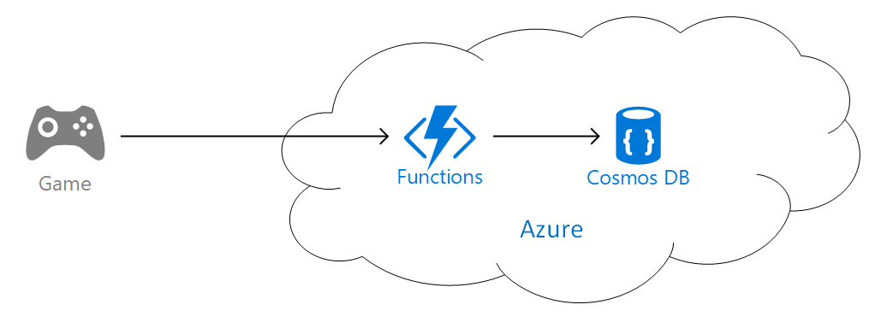

# Top N Leaderboard

This guide will help you implement a Top N Leaderboard on Microsoft Azure using a serverless architecture. The Top N leaderboard will save the top N scores, where N is a configurable positive integer, and retrieve the the sorted highscore list when requested.

## Scenario Requirements

The following requirements where considered while creating this leaderboard implementation:

* Game client should be able to send achieved scores to the leaderboard using a REST API.
* Game client should be able to retrieve the leaderboard using a REST API.

### Non Functional Requirements

* Keep scenario simple
* Minimize the need of maintainence
* Scale from low, to extreme usage
* Keep cost to a minimum
* Service should be implemented using C# Script in order for ease of understanding and modification

## Azure Services Used

This implementation uses the following services:

* [Azure Functions](https://azure.microsoft.com/en-us/services/functions/)
* [Azure Cosmos DB](https://azure.microsoft.com/en-us/services/cosmos-db/)

## Clients Frameworks/Tools

The leaderboard created in this scenario can be called from any client that can make regular HTTP requests. This documentation however will show you how to make those calls from:

* Command Line, using "curl"
* Unity, using Nether Client Library for Unity

## Prerequisite

In order to follow along in this scenario the following prerequisite need to be fulfilled:

* Have access to a Microsoft Azure Account
* Have Installed Unity 3D *

*) If you plan to call the leaderboard from a Unity game

## Getting started

### 1. Understanding the architecture

This scenario uses a very simple architecture in order to achieve the required outcome. The game will communicate with a custom REST API, hosted as a set of "Functions" in Azure. Those functions will then reach down to "Cosmos DB" in order to save or retrieve the required data.

#### Architecture Diagram

Game communicates

### 2. Deploy Required Services on Microsoft Azure

There are many ways to deploy services on Microsoft Azure, pick the one that feels most natural to you, then continue to next step.

#### A) Deploy using an Azure Resource Manager, ARM, Template

Your resources in Azure can be deployed automatically using a JSON formated document, called Azure Resource Manager, ARM, Template. The template describes the needed resources/services for your deployment and if there are any dependencies between them.

You don't need to understand how they are designed in order to use them, but please have a look at our ARM Template documentation if you are interested in learning more and perhaps designing your own templates.

Have a quick look at the template being used in this scenario before you click the "Deploy to Azure" button below in order to start deployment of required resources/services. You'll be taken to the Azure Portal and might have to sign in on your account if you are not allready signed in.

Template used in this scenario: [azuredeploy.json](azuredeploy.json)

Click the below button to start deployment.

(Ctrl + Click will open the portal with the deployment in a separate tab in most browsers, hence allow you to keep this documentation available and ready to use)

You'll be asked to fill in a few parameters before deployment begins. Please provide them as following.

Parameter           | Description                   | Example Values
--------------------|-------------------------------|--------------------
Subscription        | The Azure Subscription you want to deploy to. Often you will not have more than one option here. | MySubscription
Resource group      | A resource group keeps related resources together. | Leaderboard
Location            | Defines where in the world you want your service to be deployed. | North Europe
Function App Name   | A globally unique name that will identify your Function App in Azure. Pick a name that identifies your solution. | nether
Cosmos DB Account Name | A globally unique name that will identify your Cosmos DB Account in Azure. Pick a name that identifies your solution. | netherdb

Agree to the terms and click "Purchase" to start deployment of required services for your leaderboard.

#### B)